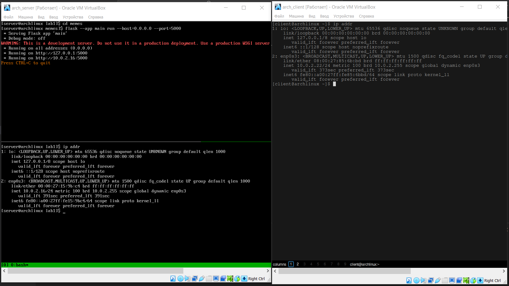
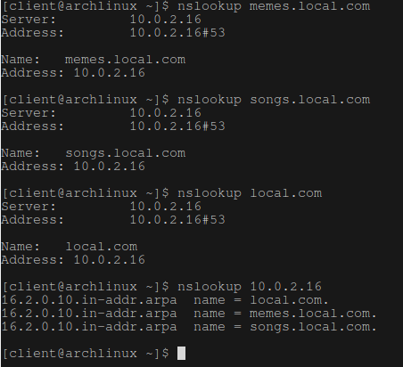
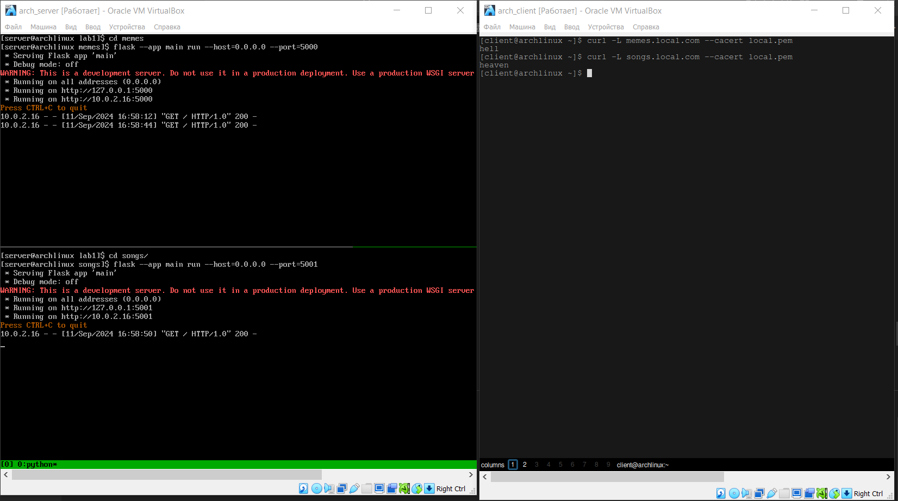

## Лаба 1. Nginx

Выполнил: Голованов Дмитрий Игоревич

Итак, для поставленную задачу я решил делать на виртуалках c arch (так как я вероятно мазохист), так что через `archinstall` поднимаю мимнимальный arch_server и десктопный arch_client и прокидываю nat network между ними. У arch_server ip 10.0.2.16, у arch_client 10.0.2.22.



На сервере также нужен git, а на клиенте можно установить firefox.

Дальше, основываясь на данной фразе в описании к лабе:
> для обслуживания нескольких доменных имен

Было решено поднять собственный локальный dns сервер (так как /etc/hosts, /var/www и подобное  - это, очевидно для ~~адекватых~~ не по-настоящему хардкорных людей)

Для реализации dns сервера был выбран [BIND](https://wiki.archlinux.org/title/BIND).

Спустя 2 дня ~~боли~~ ресёрча поднять dns сервер получилось. (рекомендую вот этот гайд, из россии только c vpn https://www.digitalocean.com/community/tutorials/how-to-configure-bind-as-a-private-network-dns-server-on-ubuntu-18-04). Кстати, все гайды на ubuntu или debian, а на arch ВСЕ пути к конфигам и их названия другие.

### BIND на локальной NAT-сети виртуалок на Arch

Итак, для того, чтобы поднять dns сервер вам понадобится: 

1. установить BIND - `sudo pacman -S bind`

2. в `/etc` закинуть `named.conf`
    ```
    acl "trusted" {
        10.0.2.16; 
        10.0.2.22; 
    };

    options {
        directory "/var/named";
        pid-file "/run/named/named.pid";
        recursion yes;
        allow-recursion { trusted; };
        listen-on { 10.0.2.16; }; 
        allow-transfer { none; }; 
        allow-update { none; };
        forwarders {
            8.8.8.8;
            8.8.4.4;
        };

        version none;
        hostname none;
        server-id none;
    };

    zone "local.com" {
        type master;
        file "db.local.com"; 
        allow-transfer { 10.0.2.16; };
    };

    zone "0.10.in-addr.arpa" {
        type master;
        file "db.10.0"; 
        allow-transfer { 10.0.2.16; }; 
    };
    ```
    В нем мы создаем зоны local.com и обратную к ней 0.10, и специфицируем файлы этих зон.

3. Кинуть `db.local.com` и `db.10.0` в `/var/named`

    `db.local.com`
    ```
    $TTL    604800
    @       IN      SOA     local.com. admin.local.com. (
                    3     ; Serial
                604800     ; Refresh
                86400     ; Retry
                2419200     ; Expire
                604800 )   ; Negative Cache TTL
    ;
    ; name servers - NS records
        IN      NS      local.com.

    ; name servers - A records
    local.com.          IN      A       10.0.2.16
    memes.local.com.          IN      A       10.0.2.16
    songs.local.com.          IN      A       10.0.2.16
    ```
    `db.10.0`
    ```
    $TTL    604800
    @       IN      SOA     local.com. admin.local.com. (
                                3         ; Serial
                            604800         ; Refresh
                            86400         ; Retry
                            2419200         ; Expire
                            604800 )       ; Negative Cache TTL
    ; name servers
        IN      NS      local.com.


    ; PTR Records
    16.2   IN      PTR     local.com.    ; 10.0.2.16
    16.2   IN      PTR     memes.local.com.    ; 10.0.2.16
    16.2   IN      PTR     songs.local.com.    ; 10.0.2.16
    ```
    Тут мы создаем 3 доменных имени: `memes.local.com`, `songs.local.com` и `local.com`.

4. Теперь нужно запустить named `sudo systemctl start named`

5. В теории dns сервер работает, но его пока никто не видит, для этого нужно настроить `/etc/resolv.conf` и, хоть это можно делать и руками, лучше воспользоваться `resolvconf`. Для этого установим его `sudo pacman -S openresolv` и кинем `resolvconf.conf` в `/etc` - 
    ```
    resolv_conf=/etc/resolv.conf
    name_servers=10.0.2.16
    ```
    и запустим `sudo resolvconf -u`. Этот же шаг нужно повторить на клиенте.

Теперь можно посмотреть на эти доменные имена через nslookup и все должно работать:



### Nginx и mkcert

Вот теперь можно приступить к выполнению лабораторной. 

Для ssl-сертификатов выбран [mkcert](https://github.com/FiloSottile/mkcert) (в целом зря, потому что слишком негибкий).

Работает он крайне просто, `sudo mkcert --install` и `sudo mkcert -key-file local-key.pem -cert-file local.pem local.com memes.local.com songs.local.com`. Все, сертификаты готовы, правда на клиенте у меня не получилось эти сертификаты установить (они работали, но не устанавливались).

Теперь нужно ~~наконец-то~~ написать `nginx.conf`

1. Добавим обработку https 
    ```
    server {
        listen 443 ssl;
        listen [::]:443 ssl;
        ssl_certificate /home/server/dev_ops_labs/lab1/local.pem;
        ssl_certificate_key /home/server/dev_ops_labs/lab1/local-key.pem;
        server_name memes.local.com;

        location / {
            proxy_pass http://memes.local.com:5000;
            proxy_set_header Host $host;
            proxy_set_header X-Real-IP $remote_addr;
        }
    }
    ```

2. Редирект с http на https
    ```
    server {
        listen 80;
        server_name memes.local.com;
        return 301 https://$server_name$request_uri;
    }
    ```

3. alias (для папки static)
    ```
    location /static/ {
        alias /home/server/dev_ops_labs/lab1/memes/static/;
    }
    ```

4. Дублируем это для второго хоста (на порте 5001) и получаем итоговый конфиг. 
    ```
    user  server;
    worker_processes  1;

    #error_log  logs/error.log;
    #error_log  logs/error.log  notice;
    #error_log  logs/error.log  info;
    error_log /var/log/nginx/error.log;
    #pid        logs/nginx.pid;


    events {
        worker_connections  4096;
    }


    http {
        include       mime.types;
        default_type  application/octet-stream;

        sendfile        on;
        keepalive_timeout  65;

        server {
            listen 80;
            server_name memes.local.com;
            return 301 https://$server_name$request_uri;
        }

        server {
            listen 443 ssl;
            listen [::]:443 ssl;
            ssl_certificate /home/server/dev_ops_labs/lab1/local.pem;
            ssl_certificate_key /home/server/dev_ops_labs/lab1/local-key.pem;
            server_name memes.local.com;

            location / {
                proxy_pass http://memes.local.com:5000;
                proxy_set_header Host $host;
                proxy_set_header X-Real-IP $remote_addr;
            }

            location /static/ {
                alias /home/server/dev_ops_labs/lab1/memes/static/;
            }
        }

        server {
            listen 80;
            server_name songs.local.com;
            return 301 https://$server_name$request_uri;
        }

        server {
            listen 443 ssl;
            listen [::]:443 ssl;
            ssl_certificate /home/server/dev_ops_labs/lab1/local.pem;
            ssl_certificate_key /home/server/dev_ops_labs/lab1/local-key.pem;
            server_name songs.local.com;

            location / {
                proxy_pass http://songs.local.com:5001;
                proxy_set_header Host $host;
                proxy_set_header X-Real-IP $remote_addr;
            }
        }
    }
    ```
    `user server` написан для того, чтобы не возиться с юзером http и его доступе к папке `static` (в целом это не секьюрно, но сказано в безопасность не углубляться)

Запустим два приложения на flask - они находятся в `/lab1/memes` и `lab1/songs`. Команда - `flask --app main run --host=0.0.0.0 --port=5000`. Для второго приложения порт будет 5001.

В целом все, осталось nginx запустить `sudo systemctl start nginx` и готово.

### Тесты и скрипты

Проверим на клиенте (сертификат на клиент отправлял через scp):



И проверим alias


Все работает!

Также сделан скрипт `setup.sh` в котором относительно автоматически вышеописанные действия выполняются.
```
sudo pacman -S bind nginx openresolv python-flask mkcert nss
sudo cp named.conf /etc
sudo cp db.10.0 /var/named
sudo cp db.local.com /var/named
sudo cp resolvconf.conf /etc


sudo mkcert --install
sudo mkcert -key-file local-key.pem -cert-file local.pem local.com memes.local.com songs.local.com

sudo cp nginx.conf /etc/nginx

sudo systemctl restart named

sudo resolvconf -u

sudo systemctl restart nginx

sudo nginx -s reload
```

И скрипт `setup_client.sh` для клиента.
```
scp resolvconf.conf local.pem client@10.0.2.15:~/
ssh client@10.0.2.22 -t "sudo resolvconf -u"
```
### Выводы

Если бы Ленин был бы программистом он бы завещал: $${\color{red}Гуглите, гуглите\ и\ гуглите}$$

Потому что пришлось гуглить МНОГО. 

Почему `/lab1/memes` и `/lab1/songs` так называются? Потому что я хотел не просто заглушки сделать, а архив с мемами и сайт для караоке, но это заняло бы слишком много времени (может быть когда-нибудь).

И вообще надо бы все это автоматически делать через например vagrant и ansible, но я хотел клиентскую виртуалку сделать десктопной, чтобы можно было в браузере ссылки открывать.

