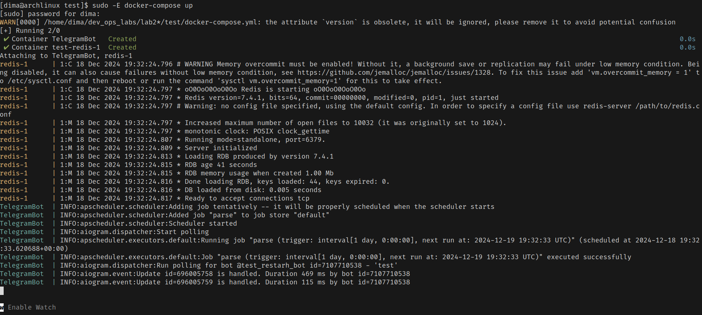
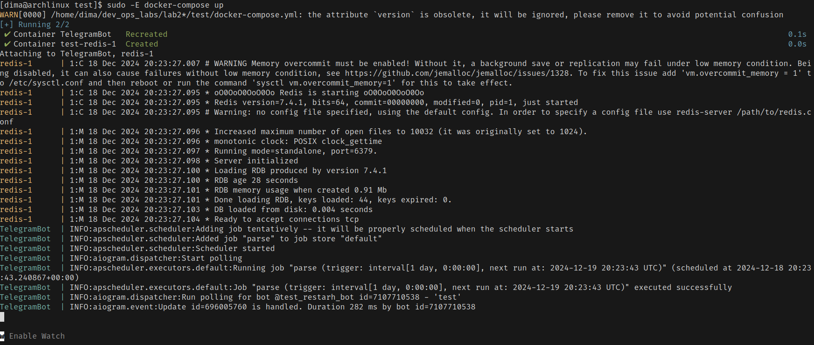
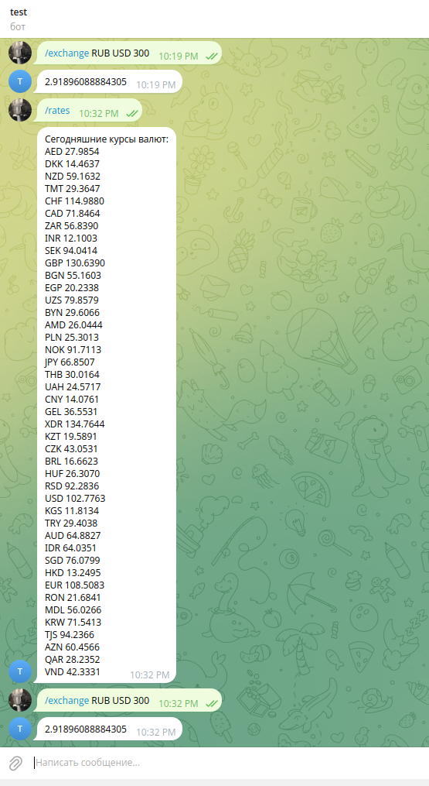
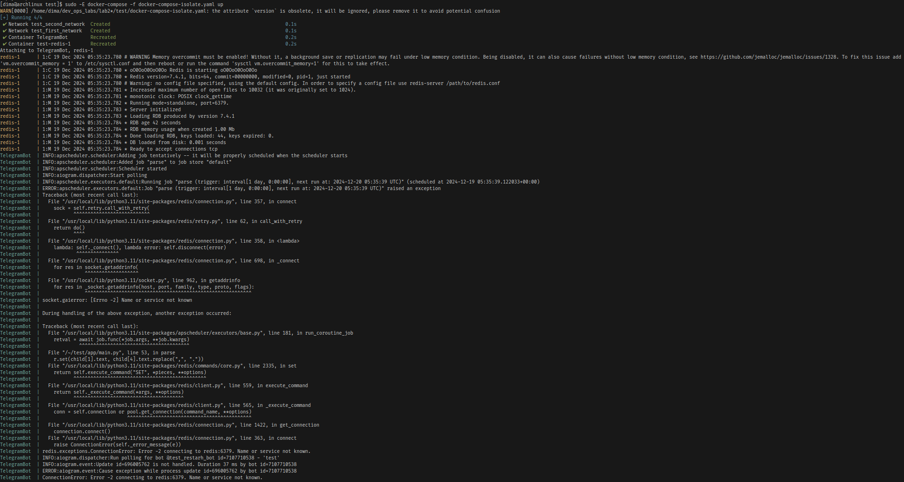

## Лаба 2. Docker

Выполнили: Голованов Дмитрий Игоревич, Стафеев Иван Алексеевич

Поднимать мы решили тележного бота с редисом (какое-то тестовое задание для приема на работу)

Bad practices мы решили взять отсюда https://earthly.dev/blog/youre-using-docker-compose-wrong/

Собственно плохой docker-compose.yaml (я ничего не менял, возможно именно из-за него меня даже на собес не позвали):

```
version: '3.9'

services:

    telegram_bot:
        container_name: TelegramBot
        image: telegram_bot

        build: .

        environment:
            - BOT_TOKEN=${BOT_TOKEN}

        ports:
            - "443:443"

        volumes:
          - ./logs:/~/TelegramBotDockerTmpl/logs

        restart: on-failure

    redis:
      image: "redis:alpine"
```
Логи: 


Какие проблемы? Ну,
1. Используется сеть устройства
2. Привязка открытых портов к 0.0.0.0
3. Неограниченность ресурсов для сервисов

Собственно убираем:

```
version: '3.9'

services:
    telegram_bot:
        container_name: TelegramBot
        image: telegram_bot
        build: .
        environment:
            - BOT_TOKEN=${BOT_TOKEN}
        ports:
            - "127.0.0.1:443:443"
        volumes:
            - ./logs:/~/TelegramBotDockerTmpl/logs
        restart: on-failure
        networks:
            - app_network
        deploy:
            resources:
                limits:
                    cpus: '0.50'
                    memory: 512M
                reservations:
                    cpus: '0.25'
                    memory: 256M
    redis:
        image: "redis:alpine"
        ports:
            - "127.0.0.1:6379:6379"
        networks:
            - app_network
        deploy:
            resources:
                limits:
                    cpus: '0.10'
                    memory: 128M
                reservations:
                    cpus: '0.05'
                    memory: 64M
networks:
    app_network:
        driver: bridge
```
Уже получше. 
Логи: 


Скрин телеги с работающим ботом:


Чтобы изолировать контейнеры друг от друга, просто поместим их в разные сети:
```
version: '3.9'

services:
    telegram_bot:
        container_name: TelegramBot
        image: telegram_bot
        build: .
        environment:
            - BOT_TOKEN=${BOT_TOKEN}
        ports:
            - "127.0.0.1:443:443"
        volumes:
            - ./logs:/~/TelegramBotDockerTmpl/logs
        restart: on-failure
        networks:
            - first_network
        deploy:
            resources:
                limits:
                    cpus: '0.50'
                    memory: 512M
                reservations:
                    cpus: '0.25'
                    memory: 256M
    redis:
        image: "redis:alpine"
        ports:
            - "127.0.0.1:6379:6379"
        networks:
            - second_network
        deploy:
            resources:
                limits:
                    cpus: '0.10'
                    memory: 128M
                reservations:
                    cpus: '0.05'
                    memory: 64M
networks:
    first_network:
        driver: bridge
    second_network:
        driver: bridge
```
Собственно судя по тому как питон не может достучаться до redis, понятно что доступа нет:


Типо все