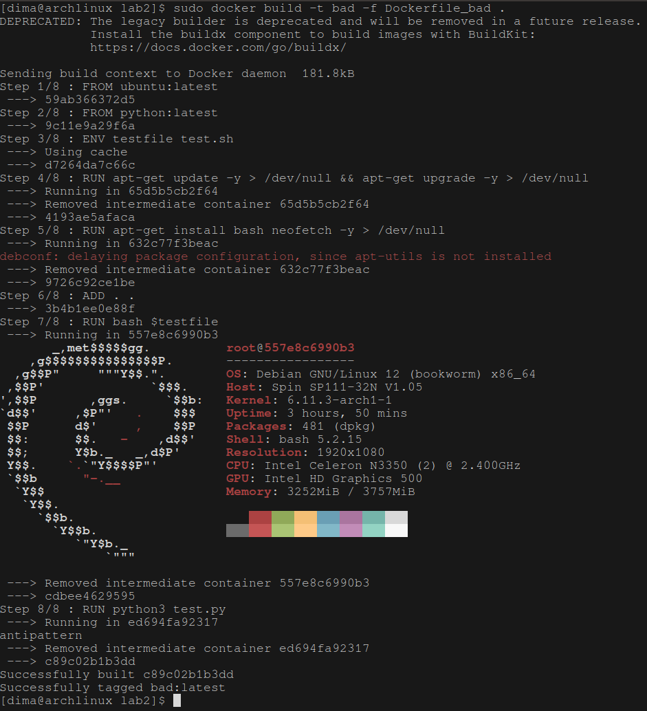
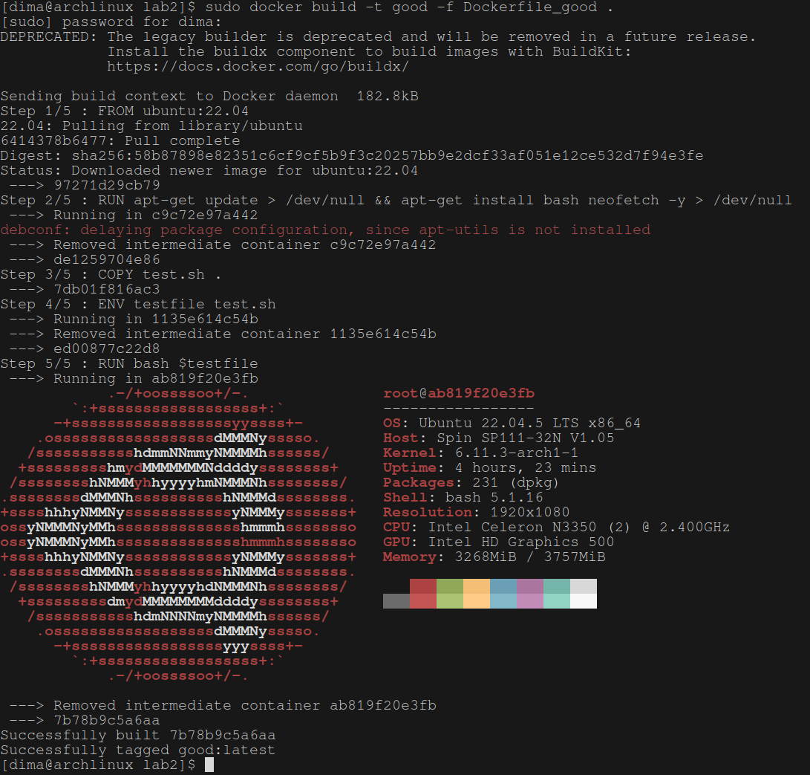

## Лаба 2. Docker

Выполнили: Голованов Дмитрий Игоревич, Стафеев Иван Алексеевич

Bad practices мы решили взять отсюда http://codenow.github.io/blog/9-common-dockerfile-mistakes

Собственно плохой докерфайл:
```
FROM ubuntu:latest
FROM python:latest

ENV testfile test.sh

RUN apt-get update -y > /dev/null && apt-get upgrade -y > /dev/null
RUN apt-get install bash neofetch -y > /dev/null
ADD . .
RUN bash $testfile
RUN python3 test.py

```

В чем проблемы? 
1. Больше чем один FROM - при этом используется только второй
2. :latest - image может сломаться в новой обнове, поэтому лучше специфицировать версию
3. apt-get ungrade - примерно тоже самое что и предыдущий пункт
4. apt-get unpdate не в одной строчке с apt-get install - тогда update закэшируется и не будет запускаться каждый билд
5. ENV - нужно объявлять его как можно позже
6. Добавление всей папки с проектом - можно что-то ненужное скопировать
7. ADD - разархивирует архивы и wget-ит ссылки, что может быть проблемой
7. Запуск чего-то во во время билда - это плохо, так как image должен быть многоразовым, а так этот принцип нарушается

В результате у нас будет долго будет создаваться контейнер.
Логи: 


Все фиксится довольно легко:
```
FROM ubuntu:22.04

RUN apt-get update > /dev/null && apt-get install bash neofetch -y > /dev/null
COPY test.sh .
ENV testfile test.sh
RUN bash $testfile
```

Убрали фром, заменили на версию, убрали upgrade и установку neofetch в тот же лайн добавили, заменили ADD на COPY и скопировали только один файл, перенесли ENV подальше.

Логи:

