## Лабораторная работа №3* по DevOps

**Выполнили**: Стафеев Иван (K3221), Голованов Дмитрий (K3223)

**Цель:** Сделать красиво работу с секретами. Например, поднять Hashicorp Vault (или другую секретохранилку) и сделать так, чтобы ci/cd пайплайн (или любой другой ваш сервис) ходил туда, брал секрет, использовал его не светя в логах. В Readme аргументировать почему ваш способ красивый, а также описать, почему хранение секретов в CI/CD переменных репозитория не является хорошей практикой.

### Пререквизит: код "проекта"

Реализуемый в этой лабораторной "проект" полностью совпадает с тем, который был описан в [лабораторной №3](https://github.com/Tronnert/dev_ops_labs/tree/main/lab3). По сути эта лабораторная - усиление предыдущей, так что использование того же проекта оправданно. Напомним, в чем его суть.

Имеется лог пользовательской активности на сайте вида
```bash
userid	timestamp	action	value	testids
user_0001	2022-02-04T09:04:00	category	0.00	12125;16320;12619;11095
user_0001	2022-02-04T09:07:00	search	0.00	12125;16320;12619;11095
user_0001	2022-02-04T09:07:00	product	0.00	12125;16320;12619;11095
user_0001	2022-02-04T09:12:00	mainpage	0.00	12125;16320;12619;11095
user_0001	2022-02-04T09:17:00	confirmation	28790.00	12125;16320;12619;110951
...
```

Необходимо подсчитать DAU по покупкам для месяца с наименьшей прибылью для компании. Для этого был написан [код](https://github.com/Tronnert/dev_ops_labs/blob/main/lab3*/mr_script.py) и [тест](https://github.com/Tronnert/dev_ops_labs/blob/main/lab3*/test_mr_script.py). Код написан на Python с использованием библиотеки `mrjob` (предполагается, что задача выполняется на кластере)

Исходя из задачи, можно определить пайплайн для CI/CD: установка Python и необходимых зависимостей, линтинг кода, проведение тестов, а затем создание Docker-образа и отправка его на Docker Hub.

Работа с секретами нужна на последнем этапе, так как для пуша образа на DockerHub нужен токен, и именно для хранения этого токена и получения доступа к нему будет использована секретохранилка.

### Установка HashicorpVault

Мы решили использовать [образ](https://hub.docker.com/r/hashicorp/vault) HashicorpVault на DockerHub. Устанавливаем его через `docker pull hashicorp/vault`

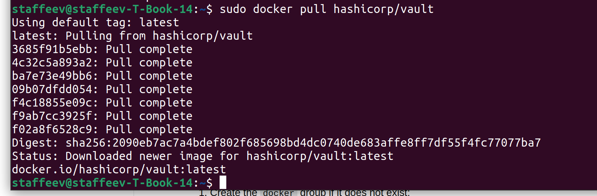

Затем запустим контейнер, использовав команду `sudo docker run -d --name vault --cap-add=IPC_LOCK -e 'VAULT_DEV_ROOT_TOKEN_ID=5ebe2294ecd0e0f08eab7690d2a6ee69' -e 'VAULT_DEV_LISTEN_ADDRESS=0.0.0.0:8200' hashicorp/vault`, где важным для нас является `ROOT_TOKEN_ID` и `VAULT_DEV_LISTEN_ADDRESS` (их нужно запомнить).

Проверим, что контейнер работает:

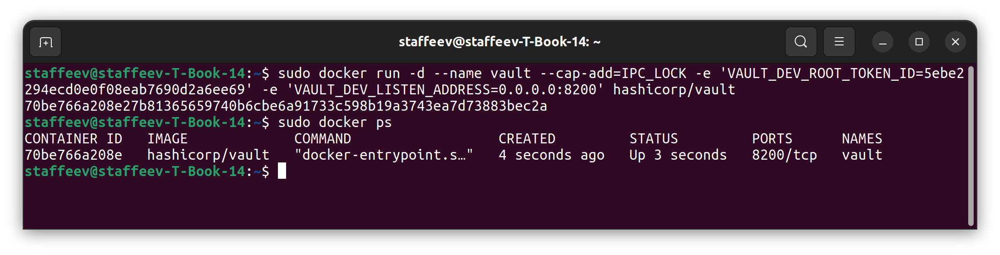

Получим IP-адрес, на котором работает секретохранилка, и сохраним его в переменную `VAULT_ADDR`:

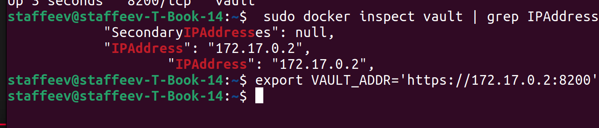

Как видно, по этому адресу и на выбранном нами порте (8200), Vault-сервер действительно работает:

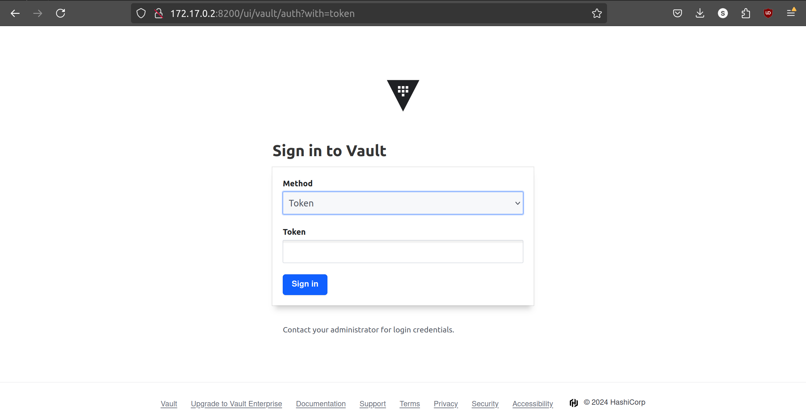

А чтобы войти, нужно указать `ROOT_TOKEN_ID`, который мы задавали при запуске контейнера (`5ebe2294ecd0e0f08eab7690d2a6ee69`):

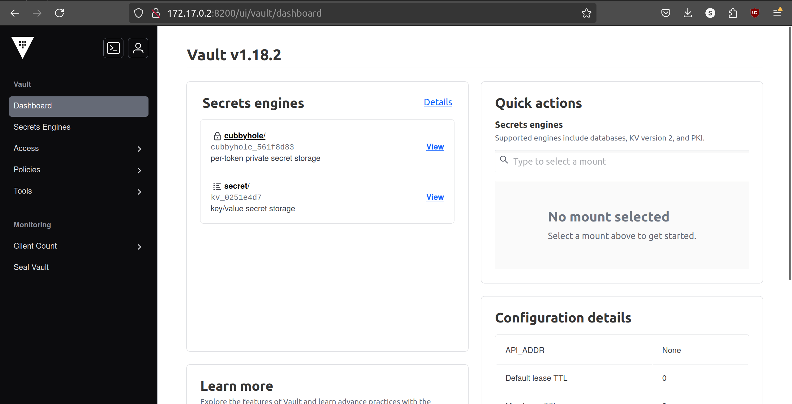

Затем нужно установить Vault CLI. С [официального сайта](https://developer.hashicorp.com/vault/install?product_intent=vault) был скачан бинарник, который после разархивирования перемещен в `/usr/bin` в соответствии с [документацией](https://developer.hashicorp.com/vault/docs/install/install-binary). После этого можно проверить успешность установки через команду `vault -version`. Видим, что все прошло успешно.

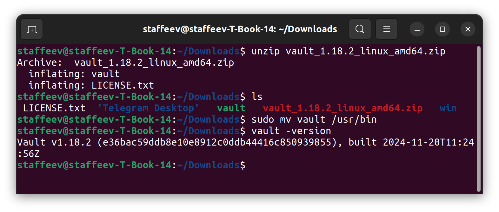

Сохраним адрес сервера и токен в переменные `VAULT_ADDR` и `VAULT_TOKEN` (первый мы нашли через `docker inspect`, второй мы задавали при создании контейнера). Авторизуемся в vault, использовав этот токен. Vault подключится к серверу с адресом, записанным в `VAULT_ADDR` (по умолчанию там будет `127.0.0.1:8200`, но у нас другой адрес - `172.0.0.2:8200`).

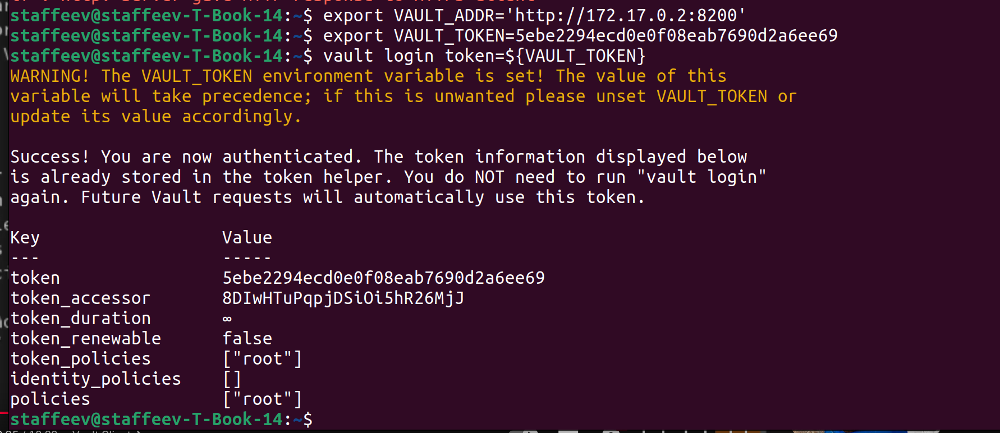

С помощью команды `vault kv put` создаем два секрета, `DOCKERHUB_USERNAME` и `DOCKERHUB_TOKEN` для имени пользователя и токена для DockerHub соответственно (мы указали `-mount="secret" "dockerhub"` для пути сохранения секретов; сам путь имеет вид `secret/data/dockerhub`). Для проверки того, что секреты создались, используем команду `vault kv get`.

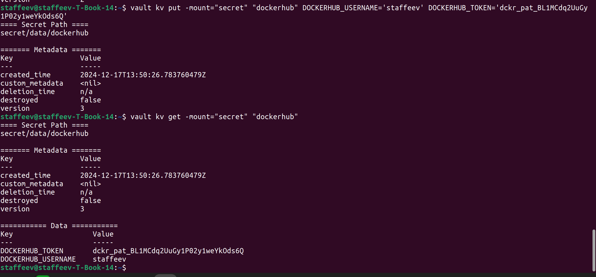

Видно, что два секрета успешно были созданы.

### Установка ngrok

Секреты работают и их можно использовать, но (!) локально. Чтобы иметь возможность их использовать в CI/CD пайплайне, нужно каким-то образом получить публичный URL для Vault-сервера. Сделать это поможет ngrok.

Устанавливаем через команду `sudo apt install ngrok`

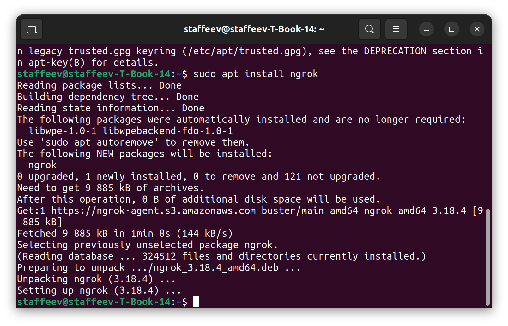

Затем создаем туннель для адреса Vault-сервера с помощью команды `ngrok http ${VAULT_ADDR}`. Видим, что туннель создался, и нам надо запомнить публичный URL, записанный в Forwarding.

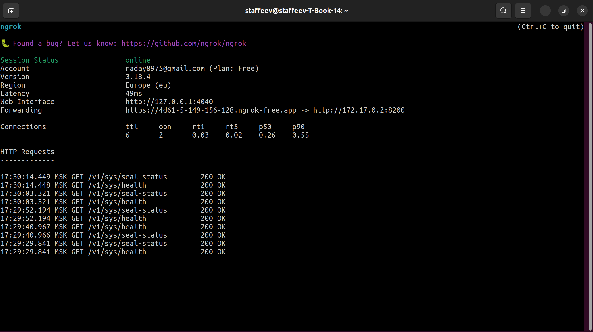

Перейдем по этому URL и введем сохраненный ранее vault-токен. Созданные ранее секреты тут есть! (не говоря уже о том, что в принципе Vault работает по публичной ссылке)

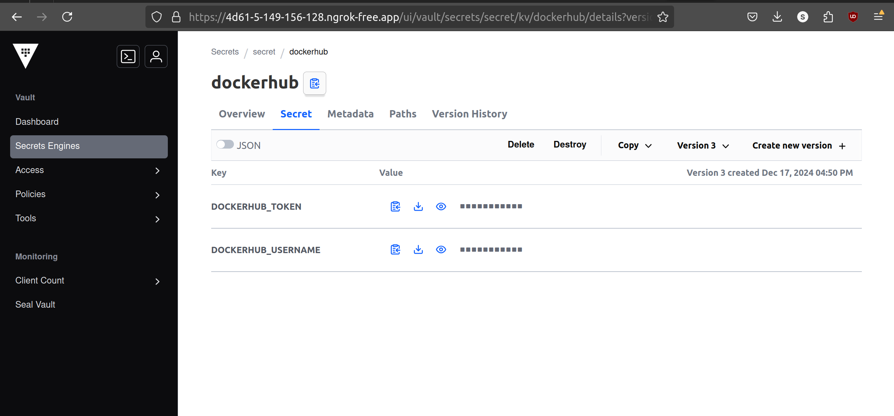

### Создание CI/CD-пайплайна

Для теста был создан отдельный [репозиторий](https://github.com/staffeev/devops_lab3_star). В настройках добавляем секреты: `VAULT_TOKEN`, который мы использовали ранее для авторизации в Vault, и `VAULT_ADDR`, куда мы заносим ***публичный*** адрес Vault-сервера, созданный ранее через ngrok (это важно, и без этого ничего работать не будет).

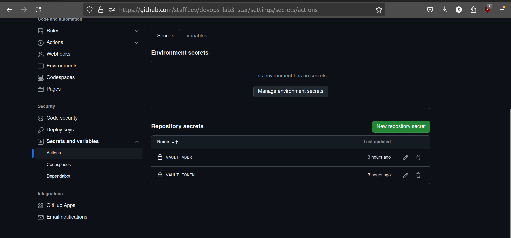

Теперь создаем сам [пайплайн](https://github.com/Tronnert/dev_ops_labs/blob/main/lab3*/.github/workflows/pipeline.yml)


Основное отличие от прошлого [пайплайна](https://github.com/Tronnert/dev_ops_labs/blob/main/lab3/.github/workflows/pipeline.yml), который был сделан в лабораторной №3 (без звездочки), состоит в наличии шага для получения секретов:

```bash
- name: Import Secrets
    uses: hashicorp/vault-action@v2
    with:
    url: ${{ secrets.VAULT_ADDR }}
    token: ${{ secrets.VAULT_TOKEN }}
    secrets: |
        secret/data/dockerhub DOCKERHUB_USERNAME | DOCKERHUB_USERNAME ;
        secret/data/dockerhub DOCKERHUB_TOKEN | DOCKERHUB_TOKEN  ;
```

Здесь используется готовый Github-action от Hashicorp, с поощью которого мы получаем созданные секреты (они сохраняются в `env`). Можно заметить, что именно на этом шаге используются секреты, добавленные в репозиторий (`VAULT_ADDR` и `VAULT_TOKEN`).

Полностью пайплайн выглядит следующим образом:

```bash
name: MapReduce script

on:
  push:
    branches:
        - main

jobs:
  build:
    runs-on: ubuntu-20.04
    steps:
    - name: Checkout code
      uses: actions/checkout@v4

    - name: Set up Python
      uses: actions/setup-python@v3
      with:
        python-version: "3.10"
        cache: 'pip'

    - name: Install dependencies
      run: |
        python -m pip install --upgrade pip
        pip install flake8 pytest
        if [ -f requirements.txt ]; then pip install -r requirements.txt; fi

    - name: Lint code
      run: |
        flake8 . --count --statistics --show-source

    - name: Test with pytest
      run: |
        pytest

  deploy:
    runs-on: ubuntu-20.04
    needs: build
    steps:

    - name: Import Secrets
      uses: hashicorp/vault-action@v2
      with:
        url: ${{ secrets.VAULT_ADDR }}
        token: ${{ secrets.VAULT_TOKEN }}
        secrets: |
          secret/data/dockerhub DOCKERHUB_USERNAME | DOCKERHUB_USERNAME ;
          secret/data/dockerhub DOCKERHUB_TOKEN | DOCKERHUB_TOKEN  ;

    - name: Login to Docker Hub
      uses: docker/login-action@v3
      with:
          username: ${{ env.DOCKERHUB_USERNAME }}
          password: ${{ env.DOCKERHUB_TOKEN }}
    
    - name: Build and push
      uses: docker/build-push-action@v6
      with:
          push: true
          tags: ${{ env.DOCKERHUB_USERNAME }}/mapreduce_script:latest
```

После получения секретов происходит авторизация на DockerHub и build&push образа кода проекта в него. Здесь уже используются переменные, записанные в `env`.

Результат выполнения пайплайна показан на картинках ниже.

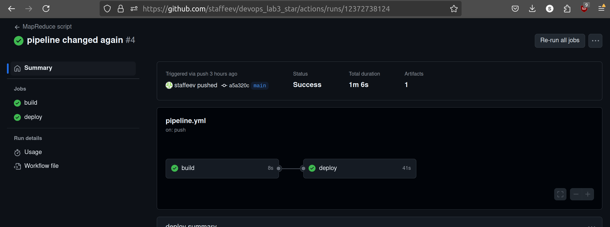

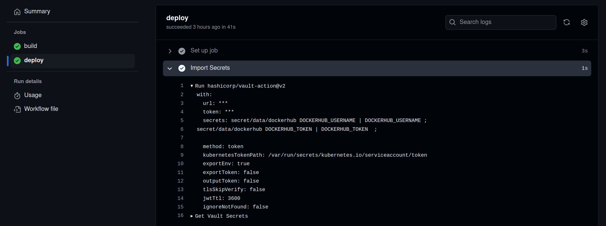

и на DockerHub образ был успешно загружен:

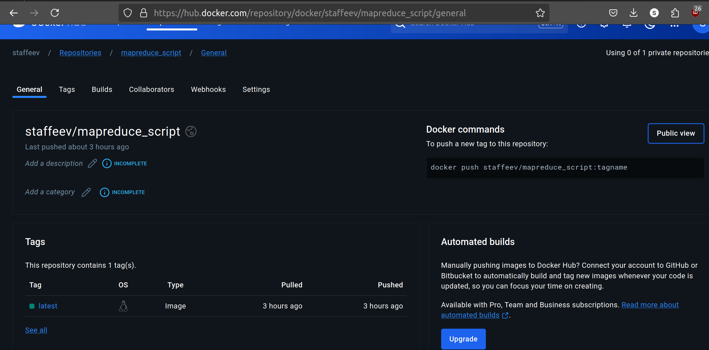

Все работает, и лабораторную работу можно считать выполненной!

### Обзор на такой способ использования секретов

