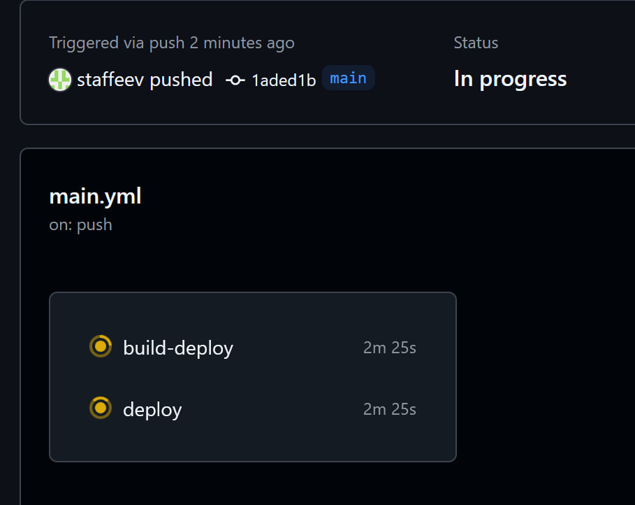
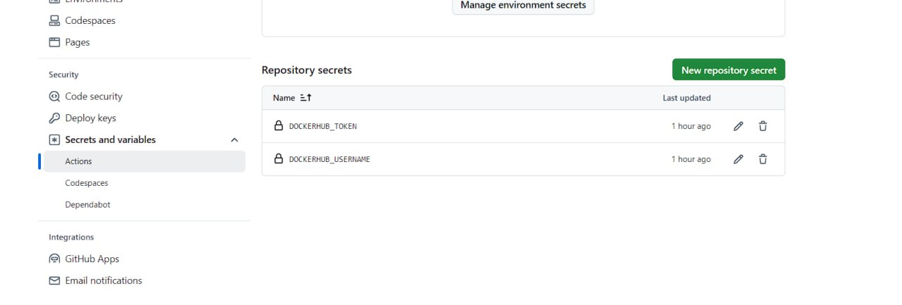
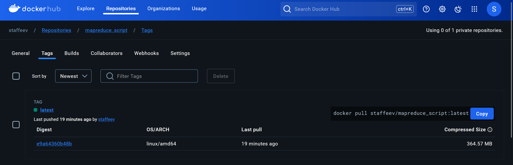

## Лабораторная работа №3 по DevOps

**Выполнили**: Стафеев Иван, Голованов Дмитрий

**Задачи**:
- написать плохой CI/CD файл, содержащий не менее 5 bad practices
- исправить файл,  объяснив суть этих bad practices

### Пререквизит: код "проекта"

Чтобы не писать эфемерный пайплайн, который никак с реальностью не связан, была создана псевдопромышленная задача.

Имеется лог пользовательской активности на сайте вида
```bash
userid	timestamp	action	value	testids
user_0001	2022-02-04T09:04:00	category	0.00	12125;16320;12619;11095
user_0001	2022-02-04T09:07:00	search	0.00	12125;16320;12619;11095
user_0001	2022-02-04T09:07:00	product	0.00	12125;16320;12619;11095
user_0001	2022-02-04T09:12:00	mainpage	0.00	12125;16320;12619;11095
user_0001	2022-02-04T09:17:00	confirmation	28790.00	12125;16320;12619;110951
...
```

Необходимо подсчитать DAU по покупкам для месяца с наименьшей прибылью для компании. Для этого был написан [код](https://github.com/Tronnert/dev_ops_labs/blob/main/lab3/mr_script.py) и [тест](https://github.com/Tronnert/dev_ops_labs/blob/main/lab3/test_mr_script.py). Приводить код здесь смысла нет, можно посмотреть по ссылке. Код написан на Python с использованием библиотеки `mrjob` (предполагается, что задача выполняется на кластере)

Исходя из задачи, можно определить пайплайн для CI/CD: установка Python и необходимых зависимостей, линтинг кода, проведение тестов, а затем создание Docker-образа и отправка его на Docker Hub.

### Плохой CI/CD

Сначала напишем плохой [CI/CD](https://github.com/Tronnert/dev_ops_labs/blob/main/lab3/.github/workflows/bad_pipeline.yml).

```yaml
name: MapReduce script

on: push # выполнится при пуше на любых ветках

jobs:
  build-test:
    # последняя версия не всегда стабильна
    runs-on: ubuntu-latest 

    steps:
    - name: Checkout code
      # совсем устаревшие версии actions
      uses: actions/checkout@v1

    - name: Set up Python
      uses: actions/setup-python@v1
      with:
        python-version: "3.10"

    - name: Install dependencies
      # хардирование пакетов для установки
      # отсутствие кэширования
      run: |
        pip install flake8 pytest mrjob

    - name: Lint code
      # линтинг не остановит пайплайн при наличии ошибок
      run: |
        flake8 .lab3/ --exit-zero

    - name: Test with pytest
      run: |
        pytest
    
  deploy:
    runs-on: ubuntu-latest
    # хранение секретных данных в открытом доступе
    env:
        DOCKER_HUB_USERNAME: staffeev
        DOCKER_HUB_TOKEN: dckr_pat_rLeRy6m8wfDjmWFqfP_IwQ9LJcg
    steps:

    - name: Login to Docker Hub
      uses: docker/login-action@v2
      with:
          username: ${{ env.DOCKER_HUB_USERNAME }}
          password: ${{ env.DOCKER_HUB_TOKEN }}
    
    - name: Build and push
      uses: docker/build-push-action@v2
      with:
          push: true
          tags: ${{ env.DOCKER_HUB_USERNAME }}/mapreduce_script:latest
```

### Обзор ошибок и способы исправления

#### 1. Отсутствие указания веток у `on:`

В плохом коде пайплайн будет выполняться при пуше на любую ветку: `on: push`. Если в репозитории всего одна ветка, проблем нет, но так обычно не бывает. Подобный пайплайн необходим при пуше в основную ветку, когда будет создаваться новая версия проекта, но в ветках разработки он не нужен (нужен далеко не всегда). Понятно, что это сильно замедляет общую работу, когда выполняется пайплайн, особенно, если он нагруженный (в нашем случае время тратится на создание Docker-образа).

Чтобы это исправить, укажем,что выполняться он должен только при пуше в `main`:

```yaml
on:
  push:
    branches:
        - main
```

#### 2. Использование последней версии ВМ для запуска пайплайна

Везде в пайплайне указана последняя версия Ubuntu для запуска (`runs-on: ubuntu-latest `). Использовать самую последнюю версию не есть хорошо, поскольку она еще может быть нестабильна, соответственно, могут возникать непредвиденные ошибки. Лучше зафиксировать ту версию ВМ, в которой вы точно уверены, например, `runs-on: ubuntu-20.04`.

*Замечание*: вероятно, Github Actions сам не добавит ту версию ВМ, которая еще не прошла проверку временем (ответ на это мы не нашли), поэтому использовать `latest` вполне можно, но в общем случае использование самых-самых последних версий чего бы то ни было создает риски.

#### 3. Использование устаревших версий используемых actions.

В плохом пайплайне везде указаны устаревшие версии подключаемых actions, например, `uses: actions/checkout@v1` (уже существует `v4`). Устаревшие версии могут содержать ошибки или недочеты (недаром в принципе присходят обновления), поэтому лучше использовать новые версии: `uses: actions/checkout@v4`.

*Замечание*: GitHub Action как вещь гораздо более просто устроенная, нежели целый дистриубтив, используемый в ВМ для запуска пайплайна, поэтому использование их самых последних версий более оправданно, чем у машины для ВМ, поскольку все возможные ошибки у Action выявляются значительно быстрее.

#### 4. Хардирование зависимостей

Установка зависимостей сейчас выглядит следующим образом:

```yaml
- name: Install dependencies
      run: |
        pip install flake8 pytest mrjob
```

В коде проекта используется (пока) только одна сторонняя библиотека - `mrjob`, но если будут использоваться и другие, то пайплайн упадет с ошибкой при тестах дальше, потому что нужные зависимости не будут дописаны.

Для решения проблемы будем устанавливать все зависимости из файла `requirements.txt`, что для Python является стандартом:

```yaml
- name: Install dependencies
      run: |
        python -m pip install --upgrade pip
        pip install flake8 pytest
        if [ -f requirements.txt ]; then pip install -r requirements.txt; fi
```

(flake8 и pytest можно зфиксировать, так как они используются всегда вне зависимости от версии проекта) 

#### 5. Отсутствие кэширования зависимостей

Отсутствие кэширования зависимостей может приводить в замедлению выполнения пайплайна и лишней трате вычислительных ресурсов. Добавим кэширование:

```yaml
- name: Set up Python
      uses: actions/setup-python@v3
      with:
        python-version: "3.10"
        cache: 'pip'
```

#### 6. Отсутствие линтинга (или плохой линтинг)

Логично, что перед добавлением кода в репозиторий хорошо бы его проверить на наличие синтаксических ошибок, т.е. выполнить линтинг, иначе в репозитории может оказаться нерабочий код. Сейчас линтинг выглядит следующим образом:

```yaml
    - name: Lint code
      run: |
        flake8 .lab3/ --exit-zero
```

Флаг `--exit-zero` указывает, что при наличии ошибок не надо останавливать выполнение пайплайна. То есть этот линтинг ничего не делает (уберем код и ничего не изменится, он разве что напишет сообщение, что не все хорошо).

Исправим на нормальный линтинг с выводом ошибок:

```yaml
- name: Lint code
      run: |
        flake8 ./lab3 --count --statistics --show-source
```

#### 7. Отсутствие связи между jobs

В нашем пайплайне две job'ы, `build-test` и `deploy`. Они должны выполняться друг за другом, но в пайплайне эо нигде не указано. Соответственно, может случиться, что `deploy` будет выполняться раньше, чем `build-test`, что приведет к ошибкам, пушу нерабочего кода на DockerHub и прочему (могут быть job'ы, которые друг от друга не зависят, но это не наш случай).

На примере выполнения пайплайна видно, что job'ы идут не последовательно:



Исправим, добавив в job'у `deploy` указание `needs: build`.

#### 8. Хранение секретных данных в пайплайне

Для загрузки в DockerHub необходимо авторизоваться, для чего используется секретный токен. Сейчас все секреты хранятся в `env`. Понятно, что ни о какой безопасности речь идти не может в таком случае.

```yaml
deploy:
    runs-on: ubuntu-latest
    env:
        DOCKER_HUB_USERNAME: staffeev
        DOCKER_HUB_TOKEN: dckr_pat_rLeRy6m8wfDjmWFqfP_IwQ9LJcg
    steps:

    - name: Login to Docker Hub
      uses: docker/login-action@v2
      with:
          username: ${{ env.DOCKER_HUB_USERNAME }}
          password: ${{ env.DOCKER_HUB_TOKEN }}
    
    - name: Build and push
      uses: docker/build-push-action@v2
      with:
          push: true
          tags: ${{ env.DOCKER_HUB_USERNAME }}/mapreduce_script:latest
```

(если что, токен уже не работает)

Для исправления грубой ошибки добавим эти секреты в репозитории через настройки:



А код пайплайна перепишем так:

```yaml
 deploy:
    runs-on: ubuntu-20.04
    needs: build
    steps:

    - name: Login to Docker Hub
      uses: docker/login-action@v3
      with:
          username: ${{ secrets.DOCKERHUB_USERNAME }}
          password: ${{ secrets.DOCKERHUB_TOKEN }}
    
    - name: Build and push
      uses: docker/build-push-action@v6
      with:
          context: .
          push: true
          tags: ${{ secrets.DOCKERHUB_USERNAME }}/mapreduce_script:latest
```

Теперь конфиденциальные данные никто не украдет, просто открыв код пайплайна.

### Хороший CI/CD

С учетом описанных выше ошибок был написан исправленный [CI/CD](https://github.com/Tronnert/dev_ops_labs/blob/main/lab3/.github/workflows/good_pipeline.ym)

```yaml
name: MapReduce script

on:
  push:
    branches:
        - main

jobs:
  build:
    runs-on: ubuntu-20.04
    steps:
    - name: Checkout code
      uses: actions/checkout@v4

    - name: Set up Python
      uses: actions/setup-python@v3
      with:
        python-version: "3.10"
        cache: 'pip'

    - name: Install dependencies
      run: |
        python -m pip install --upgrade pip
        pip install flake8 pytest
        if [ -f requirements.txt ]; then pip install -r requirements.txt; fi

    - name: Lint code
      run: |
        flake8 ./lab3 --count --statistics --show-source

    - name: Test with pytest
      run: |
        pytest

  deploy:
    runs-on: ubuntu-20.04
    needs: build
    steps:

    - name: Login to Docker Hub
      uses: docker/login-action@v3
      with:
          username: ${{ secrets.DOCKERHUB_USERNAME }}
          password: ${{ secrets.DOCKERHUB_TOKEN }}
    
    - name: Build and push
      uses: docker/build-push-action@v6
      with:
          context: .
          push: true
          tags: ${{ secrets.DOCKERHUB_USERNAME }}/mapreduce_script:latest
```

Вот подтверждение работоспособности пайплайна:


А вот подтверждение того, что Docker Image лежит на Docker Hub:



### Заключение

Цель лабораторной работы выполнена. Был написан CI/CD палпайн, содержащий плохие практики, затем эти практики объяснены и исправлены.

Держите анекдот:

*Заходит чукча в магазин цифровой и бытовой техники, долго-долго ходит и смотрит на товары, затем все же решает подойти к консультанту:
— Скажите, пожалуйста, у вас есть цветные телевизоры?
— Да
— Тогда дайте мне зелёный*
