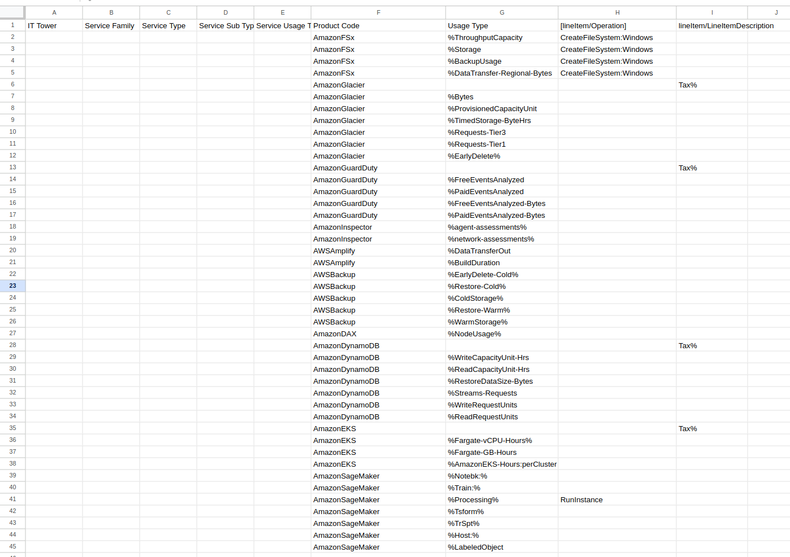
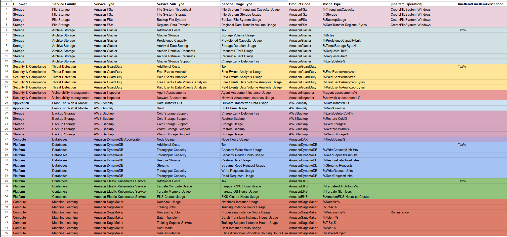

## Лабораторная работа 1. Знакомство с IaaS, PaaS, SaaS сервисами в облаке на примере Amazon Web Services (AWS). Создание сервисной модели. Вариант 8

***Выполнили***: Стафеев Иван, Голованов Дмитрий

***Цель***: Знакомство с облачными сервисами. Понимание уровней абстракции над инфраструктурой в облаке. Формирование понимания типов потребления сервисов в сервисной-модели. 

***Дано***:

1. Слепок данных биллинга от провайдера после небольшой обработки в виде SQL-параметров. 

2. Образец итогового соответствия, что желательно получить в конце. В этом же документе  

***Необходимо***:

1. Импортировать файл .csv в Excel или любую другую программу работы с таблицами. 

2. Распределить потребление сервисов по иерархии, чтобы можно было провести анализ от большего к меньшему.

3. Сохранить файл и написать отчет
Сохранить файл и залить в соответствующую папку на Google Drive.

### Откуда бралась инфа?

1. [Список IT Tower](https://higherlogicdownload.s3.amazonaws.com/TBMCOUNCIL/c15d372f-9951-46c8-9c3f-213c696401b6/UploadedImages/TBM_Taxonomy_V4_0.pdf) из TBM Taxonomy
Version 4.0

2. Сайт [AWS](https://aws.amazon.com/), содержащий список предоставляемых сервисов.

3. [Документация](https://docs.aws.amazon.com/?nc2=h_ql_doc_do) AWS. В частности, были использованы [1](https://docs.aws.amazon.com/amazondynamodb/latest/developerguide/bp-understanding-billing.html), [2](https://aws-price-list-api-values.alanwsmith.com/), [3](https://docs.aws.amazon.com/cur/latest/userguide/product-columns.html), [4](https://aws.amazon.com/blogs/machine-learning/part-3-analyze-amazon-sagemaker-spend-and-determine-cost-optimization-opportunities-based-on-usage-part-3-processing-and-data-wrangler-jobs/), [5](https://aws.amazon.com/blogs/containers/cost-optimization-checklist-for-ecs-fargate/), [6](https://docs.aws.amazon.com/AmazonS3/latest/userguide/restoring-objects.html), [7](https://docs.aws.amazon.com/AmazonS3/latest/userguide/restoring-objects-retrieval-options.html), [8](https://aws.amazon.com/blogs/networking-and-content-delivery/understand-aws-data-transfer-details-in-depth-from-cost-and-usage-report-using-athena-query-and-quicksight/) вырезки из документации (наверное, это не все, и часть утеряна)

### Начальные данные

Изначально нам был доступен следующий слепок данных биллинга:

Неоходимо заполнить недостающие данные на основе ProductCode и UsageType (и более мелкой информации в таблице). За счет сравнительного анализа (простого взгляда на ProductCode) были выявлены 10 сервисов AWS, для которых надо было определить:

1. **IT Tower** - крупный логический блок IT-инфраструктуры (Хранилище, Вычисления, Платформа и тп)

2. **Service Family** - группа сервисов, объединенных по похожим задачам

3. **Service Type** - конкретный сервис внутри группы Service Family

4. **Service Sub Type** - подсервис, предназначенный для выполнения определенной функции

5. **Usage Type** - способ интерпретации и использования подсервиса конечным пользователем

Для определения этих полей была использована документация AWS (ссылки см. выше), форум AWS, StackOverflow и ряд других источников. Оставлять здесь все ссылки на использованные ресурсы нет смысла, так как их слишком много, но для доказательства того, что мы их использовали, 8 из них написаны выше в списке ресурсов.

### Анализ сервисов

Было выделено 10 сервисов AWS, которые были поделены на группы по IT Tower. 

К **Storage** мы отнесли AmazonFSx, AmazonGlacier, AWSBackup; к **Security & Compliance** - AmazonGuardDuty и AmazonInspector; к **Application** - AWSAmplify; к **Compute** - AmazonDAX и AmazonSageMaker; к **Platform** - AmazonDynamoDB и AmazonEKS.

Поподробнее про каждый из сервисов:

(Storage)

1. **Amazon FSx** предоставляет полностью управляемые файловые системы (Windows, Linux, Lustre) в облаке. Это Storage, потому что сервис предназначен для хранения даннных.

2. **Amazon Glacier** - это хранилище для долгосрочного архивирования данных с возможностью редкого доступа. Это Storage, так как предназначен для хранения данных (длительного).

3. **AWS Backup**  предоставляет возможности автоматического резервирования данных с использованием различных сервисов AWS. Это Storage, так как он предназнчен для хранения и управления резервными копиями (=данными).

(Security & Compliance)

4. **Amazon GuardDuty** - это сервис обнаружения угроз, который анализирует журналы AWS, сетевые события и данные о поведении для выявления подозрительной активности. Это Security, так как прямо направлен на выявление угроз и повышение безопасности.

5. **Amazon Inspector** - это сервис для автоматизизации оценки безопасности и выявления уязвимостей и несоответствия указанным пользователям стандартам безопасности. Это Security, потому что предназначен для соблюдения стандартов безопасности.

(Application)

6. **AWS Amplify** - это платформа для разработки и хостинга веб- и мобильных приложений. Относится к Application, поскольку это непосредственно инструмент для разработки (development - одна из sub-tower для Appliaction)

(Compute)

7. **Amazon DAX (DynamoDB Accelerator)** - управляемый высокодоступный сервис кэширования для DynamoDB, значительно повышающий производительность этой БД. Это Compute, так как нацелен на ускорение вычислительных процессов в БД (хотя, честности ради, скажем, что можно его отнести и к Storage, так как он является хранилизем для кэшированной информации).

8. **Amazon SageMaker** предоставляет инструменты для создания, обучения и развертывания моделей ИИ вна облачной платформе. Это Compute, так как создан для предоставления вычислительных мощностей для ML.

(Platform)

9. **Amazon DynamoDB** - это высокопроизводительная NoSQL база данных, предназначенная для обработки больших объемов данных в реальном времени. Относится к Platform, так как представляет собой основную платформу для хранения структурированных данных.

10. **Amazon EKS (Elastic Kubernetes Service)**  - это сервис Kubernetes для развертывания, управления и масштабирования контейнеризированных приложений в облаке. Это Platform, потому что предоставляет инфраструктуру для оркестрации контейнеров (что есть Sub-Tower для Platform). 

### Результат выполнения

В процессе чтения документации начальная таблица была заполнена. Посмотреть ее можно на картинке ниже, в [файле](cloud_lab1.csv) или в [Google Sheets](https://docs.google.com/spreadsheets/d/1fx7WHeaJDgWnfmEA6XYJV_BAQdsEOFsVxK-F4s9b2yY/edit?usp=sharing)

### Выводы

1. Цель знакомства с AWS, понимания уровней абстракции над инфраструктурой в облаке и формирования понимания типов потребления сервисов в сервисной-модели достигнута

2. Было установлено, что не существует единой таксономии облачных сервисов и даже объектов IT Tower (например, IT Tower на [сайте AWS](https://s3-us-west-2.amazonaws.com/communityfiles.apptio.com/Education+Services/Introduction+to+ATUM_6-22-17/presentation_content/external_files/Attachment%203_Taxonomy%20-%20IT%20Towers.pdf) отличается), из-за чего могут возникать сложности в совместной работе разных групп разработчиков (да и даже в рамках одной группы).

3. Обнаружено очень большое количество сервисов AWS различной природы, подходящих под абсолютно разные задачи

~~4. Было установлено, что документация AWS ужасна, поскольку она плохо структурирована, в ней плохо работает поиск, а некоторых UsageType в официальной документации так и не было найдено~~
