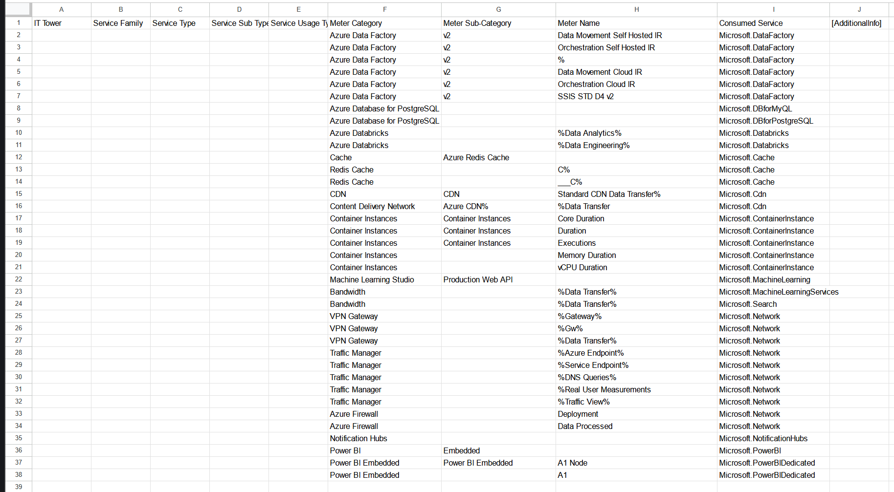
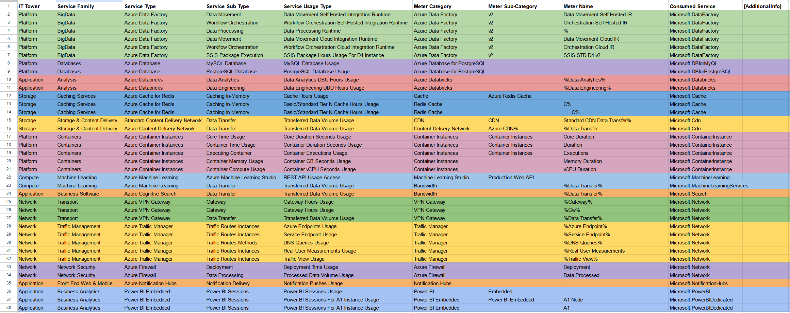

## Лабораторная работа 2. Сравнение сервисов Amazon Web Services и Microsoft Azure. Создание единой кросс-провайдерной сервисной модели. Вариант 4

***Выполнили***: Стафеев Иван, Голованов Дмитрий

***Цель***: Получение навыков аналитики и понимания спектра публичных облачных сервисов без привязки к вендору. Формирование комплексного видения Облака.

***Дано***:

1. Данные лабораторной работы #1.

2. Слепок данных биллинга от провайдера после небольшой обработки в виде SQL-параметров. Символ % заменяет любой набор символов.

3. Образец итогового соответствия, что желательно получить в конце. В этом же документе  

***Необходимо***:

1. Импортировать файл .csv в Excel или любую другую программу работы с таблицами. 

2. Распределить потребление сервисов по иерархии, чтобы можно было провести анализ от большего к меньшему.

3. Сохранить файл и написать отчет
Сохранить файл и залить в соответствующую папку на Google Drive.

### Откуда бралась инфа?

1. [Список IT Tower](https://higherlogicdownload.s3.amazonaws.com/TBMCOUNCIL/c15d372f-9951-46c8-9c3f-213c696401b6/UploadedImages/TBM_Taxonomy_V4_0.pdf) из TBM Taxonomy
Version 4.0

2. Сайт с облачными сервисами [Microsoft Azure](https://azure.microsoft.com/ru-ru).

3. [Документация](https://learn.microsoft.com/en-us/azure/?product=popular) Azure. Были использованы разделы документации для определенных в работе сервисов, а также [таблица](https://learn.microsoft.com/en-us/azure/?product=popular) Pricing для UsageType большинства найденных сервисов. Среди страниц документации были использованы, например, [1](https://learn.microsoft.com/en-us/azure/data-factory/concepts-integration-runtime), [2](https://learn.microsoft.com/en-us/rest/api/machinelearning/), [3](https://azure.microsoft.com/en-us/updates?id=guid-migration-container-instances), [4](https://learn.microsoft.com/en-us/azure/container-apps/jobs?tabs=azure-cli), [5](https://learn.microsoft.com/en-us/azure/traffic-manager/traffic-manager-configure-geographic-routing-method), [6](https://learn.microsoft.com/en-us/azure/architecture/best-practices/caching?toc=%2Fazure%2Fredis-cache%2Ftoc.json) и не только (чтоб показать, что мы действительно читали документацию Azure)

### Начальные данные

Изначально нам был доступен следующий слепок данных биллинга:

Неоходимо заполнить недостающие данные на основе ProductCode и UsageType (и более мелкой информации в таблице). За счет сравнительного анализа были выявлены 13 сервисов Microsoft Azure, для которых надо было определить:

1. **IT Tower** - крупный логический блок IT-инфраструктуры (Хранилище, Вычисления, Платформа и тп)

2. **Service Family** - группа сервисов, объединенных по похожим задачам

3. **Service Type** - конкретный сервис внутри группы Service Family

4. **Service Sub Type** - подсервис, предназначенный для выполнения определенной функции

5. **Usage Type** - способ интерпретации и использования подсервиса конечным пользователем

Для определения этих полей была использована документация Azure (ссылки см. выше) и таблица Pricing для сервисов.

### Анализ сервисов

В лабораторной работе №1 нами были составлены некоторые правила классификации сервисов, которые мы распространили и на лабораторную работу №2. Так, например, **Machine Learning** мы отнесли к IT Tower **Compute**, **Containers** и **Databases** - к **Platform**, **Front-End Web & Mobile** - к **Application**, **Caching** - к **Storage**.

Помимо этих IT Tower и соответствующих групп сервисов, в лабораторной работе №2 была добавлена IT Tower **Network** (сеть) и связанные с аналитикой **Analysis** группы сервисов.

Было выделено 13 сервисов Azure, которые были поделены на группы по IT Tower. 

К **Platform** мы отнесли Azure Data Factory, Azure Database, Azure Containers Instances; к **Application** - Azure Databricks, Azure Cognitive Search, Azure Notification Hubs, Power BI Embedded; к **Storage** - Azure Cache for Redis, Azure CDN; к **Compute** - Azure Machine Learning; к **Network** - Azure VPN Gateway, Azure Traffic Manager, Azure Firewall.

Поподробнее про каждый из сервисов:

(Platform)

1. **Azure Data Factory** - облачный инструмент интеграции данных и оркестрации пайплайнов, способный работать с данными различной природы из разных источниклв. Это Platform, так как обеспечивает основу для работы с данными и их интеграцией.

2. **Azure Database** предлагает управляемые базы данных, такие как SQL Database и Cosmos DB, обеспечивающие масштабируемость, высокую доступность и поддержку различных моделей данных. Это Platform, так как предоставляет инфраструктуру для хранения и управления данными.

3. **Azure Container Instances** - платформа для развертывания контейнеров. Это Platform, так как предоставляет инфраструктуру для оркестрации контейнеров.

(Application)

4. **Azure Databricks**  - платформа для аналитики больших данных и для машинного обучения. Это Application, так как используется для разработки приложений анализа данных и AI (к как таковой BigData в составе Platform мы не определили, так как все-таки это является интструментов поверх больших данных).

5. **Azure Cognitive Search** - систем поиска с интеграцией ИИ для извлечения информации из данных. Это Application, так как является инструментом для бизнеса для разработки поисковых решений.

6. **Azure Notification Hubs** - сервис для рассылки уведомлений на мобильные устройства. Это Application, потому что его неразрывно связан с приложениями и основной его функционал - управление коммуникацией для них.

7. **Power BI Embedded** - инструмент для бизнес-аналитики и визуализации данных. Это Application, так как покрывает собой аналитическую составляющую приложений, в которых этот сервис будет использоваться.

(Storage)

8. **Azure Cache for Redis** - сервис кэширования в памяти на основе базы данных Redis, что позволяет добиться более высокой производительности. Это Storage, так как временно хранит данные для повышения производительности.

9. **Azure CDN (Content Delivery Network)** нужен для ускорения доставки контента пользователям (в основном, веб-контента) за счет распределения данных через глобальную сеть серверов. Это Storage, поскольку завязана на хранении и доставки данных.

(Compute)

10. **Azure Machine Learning**  - инфраструктура для создания, обучения и развертывания моделей машинного обучения. Это Compute, так как создан для предоставления вычислительных мощностей для ML.

(Network)

11. **Azure VPN Gateway**  создает защищенные соединения через VPN между локальными сетями и облаком. Это Network, так как нужен для сетевой связности, сетевого доступа.

12. **Azure Traffic Manager** распределяет входящий трафик между ресурсами в различных регионах, чтобы все работало быстрее и менее нагруженно. Это Network, так как отвечает за маршрутизацию и управление трафиком.

13. **Azure Firewall** - фаерволл, централизованная защита сети, использующая фильтрацию трафика на основе определенных правил. Это Network, потому что обеспечивает безопасность и контроль действий в сети. 

### Результат выполнения

В процессе чтения документации начальная таблица была заполнена. Посмотреть ее можно на картинке ниже, в [файле](cloud_lab2.csv) или в [Google Sheets](https://docs.google.com/spreadsheets/d/1SkKx3_B2UgrejIor0YTtRo1RaswVe3kMzM3BOpR0URI/edit?usp=sharing)

### Выводы

1. Цель в виде получения навыков аналитики и понимания спектра публичных облачных сервисов без привязки к вендору и формирования комплексного видения Облака достигнута

2. Была изучены часть существующих облачных сервисов Microsoft Azure, на основе которых можно говорить о большом разнообразии облачных сервисов, подходящих под самые разные задачи (например, ML, VPN и пуш-уведомления). Пересечения в AWS, который рассматривался в лабораторной работе №1, большие, благодаря чему у пользователей и разработчиков есть свобода выбора для реализации своих проектов.

3. Таксономия облачных сервисов у Azure отличается и от [AWS](https://s3-us-west-2.amazonaws.com/communityfiles.apptio.com/Education+Services/Introduction+to+ATUM_6-22-17/presentation_content/external_files/Attachment%203_Taxonomy%20-%20IT%20Towers.pdf), и от [TBM](https://higherlogicdownload.s3.amazonaws.com/TBMCOUNCIL/c15d372f-9951-46c8-9c3f-213c696401b6/UploadedImages/TBM_Taxonomy_V4_0.pdf), что снова подтверждает отсутствие единой системы определений, что может вызывать сложности при работе